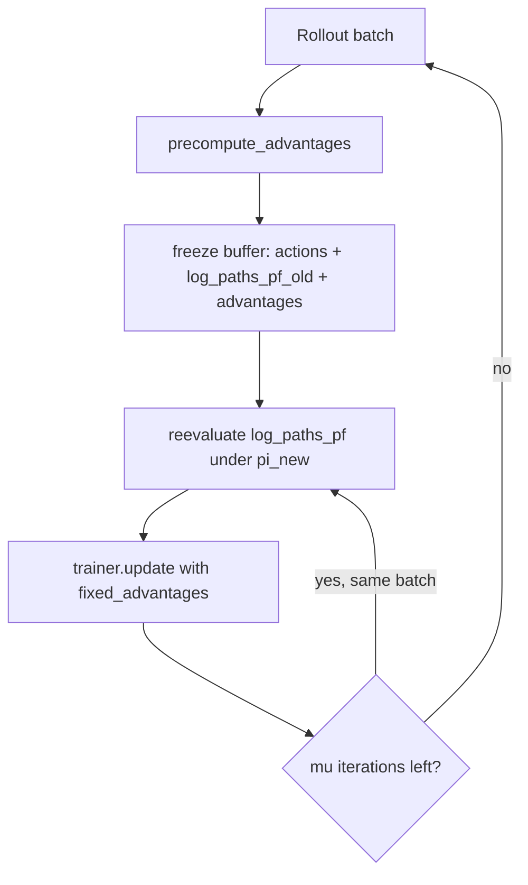
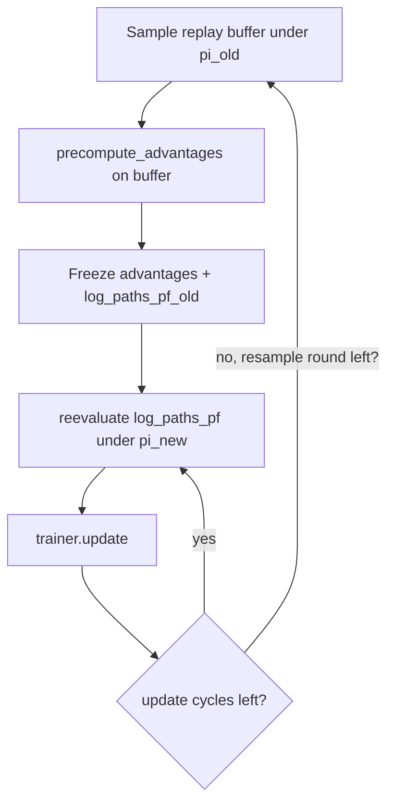

# GRPO and IPS-GRPO training flows

This document describes how **standard GRPO** and **IPS-GRPO** train the phylogenetic tree policy. Both share the same rollout, policy loss, and buffering code under `grpo_experiments/core/`. The only difference is how advantages are computed.

| Method | Entry point | Trainer |
|--------|-------------|---------|
| GRPO | `python -m grpo_experiments.train --method grpo` | `core/trainer.py` → `GRPOTrainer` |
| IPS-GRPO | `python -m grpo_experiments.ips_grpo.train` | `ips_grpo/trainer.py` → `IPSGRPOTrainer` |

---

## Shared pipeline (both methods)

Every training step starts the same way:

```
1. DataLoader.generate_batch()
      → rollout_worker.rollout(generator, B)
      → batch["log_paths_pf"]  (B, T)  per-step forward log-probs
      → batch["log_scores"]      (B,)    terminal log-likelihood
      → batch["log_rewards"]     (B,)    shaped terminal reward
      → trajectories             list of action sequences

2. (IPS only) extract outcome_ids from reconstructed trees
      → topology or signature string per trajectory

3. Trainer.update()
      → compute / load advantages
      → PPO clipped policy loss on log_paths_pf
      → backward + Adam on policy params
```

### Batch tensors

| Key | Shape | Meaning |
|-----|-------|---------|
| `log_paths_pf` | `(B, T)` | Log P_F of sampled action at merge step `t` for tree `i` |
| `log_scores` | `(B,)` | Terminal log-likelihood (no prior shaping) |
| `log_rewards` | `(B,)` | `(C + log_score) / SCALE` — logged, not used directly in GRPO loss |
| `advantages` | `(B,)` | One scalar per tree, broadcast to all `T` steps in the loss |

`T` ≈ number of taxa − 1 merge steps.

---

## Advantage computation

### GRPO (`core/advantages.py` + `core/trainer.py`)

```python
log_r   = (reward_c + log_scores) / reward_scale
rewards = exp(log_r - log_r.max())          # default mode: exp_linear
advantages = (rewards - rewards.mean()) / (rewards.std() + eps)
```

- **Group-relative**: each tree is compared to the batch mean/std.
- **No outcome information** — duplicate topologies are treated independently.
- Optional `--advantage-reward-mode log_reward` skips the `exp` and uses `log_r` directly.

### IPS-GRPO (`ips_grpo/trainer.py`)

Same base reward, then **inverse probability scaling** before group normalization:

```python
p_hat(o_i) = max(count(o_i) / G, ips_prob_floor)   # default floor = 1e-6
r_tilde_i  = rewards_i / p_hat(o_i)
advantages = (r_tilde - r_tilde.mean()) / (r_tilde.std() + eps)
```

- `outcome_ids` come from `metrics.extract_outcome_ids(trees, outcome_level)`.
- `topology`: tree shape only.
- `signature`: topology + discretized log_score.
- Rare outcomes get larger scaled rewards; frequent duplicates are downweighted.

If `outcome_ids` is omitted, `IPSGRPOTrainer` falls back to plain GRPO advantages.

---

## Policy loss (identical for GRPO and IPS-GRPO)

Implemented in `core/loss.py`, called from `GRPOTrainer.compute_policy_loss`:

```
r_t     = exp(log π_new(a_t|s_t) - log π_old(a_t|s_t))     # token-level
loss_i  = - mean_t( min(r_t * A_i, clip(r_t) * A_i) )
pg_loss = mean_i(loss_i)
```

- One advantage `A_i` per tree, broadcast across all merge steps.
- Per-sequence masked mean over steps, then mean over batch.
- Optional entropy bonus: `loss -= entropy_coef * mean_entropy`.

---

## Training modes

Both GRPO and IPS-GRPO support two modes, controlled by `--enable-policy-is`.

### Mode A — On-policy (default)

Each step: fresh rollout → compute advantages → update.



Orchestrated by `core/on_policy_buffer.py` → `run_on_policy_grpo_step`.

- `--grpo-num-iterations` (μ): reuse the same rollout for multiple gradient steps before resampling.
- When `num_iterations > 1`, `log_paths_pf_old` is frozen at sampling time; advantages stay fixed.

**GRPO runner**: `runner.py` → `_train_grpo_step` → `run_on_policy_grpo_step`

**IPS runner**: `ips_grpo/runner.py` → same function, passes `outcome_ids` in `extra_update_kwargs`

### Mode B — Policy importance sampling (`--enable-policy-is`)

Sample a fixed buffer under the behavior policy, freeze advantages, then run inner update cycles with `π_new / π_old` ratios.



Orchestrated by `core/on_policy_buffer.py` → `run_policy_is_grpo_cycles` using `core/policy_replay.py`.

- `--resample-rounds`: how many times to draw a new buffer.
- `--update-cycles`: gradient steps per buffer (advantages frozen).
- `--buffer-size`: trajectories per buffer.

IPS advantages use outcome frequencies **across the whole buffer**, not per mini-batch.

---

## Code map (where to look when debugging)

| Symptom | File to inspect |
|---------|-----------------|
| Wrong advantage values | `core/advantages.py`, `ips_grpo/trainer.py` (`scale_rewards_ips`) |
| Policy loss / clipping | `core/loss.py` |
| Optimizer step, metrics | `core/trainer.py` (`update`) |
| μ-iteration buffering | `core/on_policy_buffer.py` |
| Policy-IS replay | `core/policy_replay.py`, `core/forward_replay.py` |
| Outcome ID extraction | `metrics.py` (`extract_outcome_ids`) |
| Training loop wiring | `runner.py` (GRPO), `ips_grpo/runner.py` (IPS) |

### Metrics logged to `metrics.jsonl`

| Metric | GRPO | IPS | Meaning |
|--------|------|-----|---------|
| `mean_advantage` | ✓ | ✓ | Batch mean of advantages (≈ 0) |
| `std_advantage` | ✓ | ✓ | Batch std (≈ 1 before clipping effects) |
| `ips_prob_mean` | — | ✓ | Mean floored outcome probability |
| `ips_scaled_reward_mean` | — | ✓ | Mean reward after IPS scaling |
| `ips_mode` | — | ✓ | `"ips"` or `"grpo"` (fallback) |
| `mean_importance_ratio` | policy-IS | policy-IS | Mean token-level π_new/π_old |
| `pg_loss` | ✓ | ✓ | Policy gradient term |

---

## Quick commands

```bash
# GRPO on-policy
python -m grpo_experiments.train --method grpo \
  --on-policy-batch-size 64 --epochs 5 --steps-per-epoch 10

# GRPO + policy IS
python -m grpo_experiments.train --method grpo --enable-policy-is \
  --resample-rounds 5 --update-cycles 10 --buffer-size 1000

# IPS-GRPO on-policy
python -m grpo_experiments.ips_grpo.train \
  --on-policy-batch-size 64 --epochs 5 --steps-per-epoch 10

# IPS-GRPO + policy IS
python -m grpo_experiments.ips_grpo.train --enable-policy-is \
  --resample-rounds 5 --update-cycles 10 --buffer-size 1000 \
  --outcome-level topology --ips-prob-floor 1e-6
```

---

## GRPO vs IPS-GRPO (one glance)

```
                    ┌─────────────────────────────────────┐
                    │           ROLLOUT (shared)          │
                    │  log_paths_pf, log_scores, actions  │
                    └──────────────────┬──────────────────┘
                                       │
              ┌────────────────────────┴────────────────────────┐
              │                                                 │
              ▼                                                 ▼
    ┌──────────────────┐                            ┌──────────────────────┐
    │      GRPO        │                            │      IPS-GRPO        │
    │  r = f(log_score)│                            │  r = f(log_score)    │
    │  A = norm(r)     │                            │  r̃ = r / p̂(outcome) │
    │                  │                            │  A = norm(r̃)         │
    └────────┬─────────┘                            └──────────┬───────────┘
             │                                                  │
             └────────────────────┬─────────────────────────────┘
                                  ▼
                    ┌─────────────────────────────────────┐
                    │   PPO loss (core/loss.py) — shared  │
                    │   backward + Adam — shared            │
                    └─────────────────────────────────────┘
```
